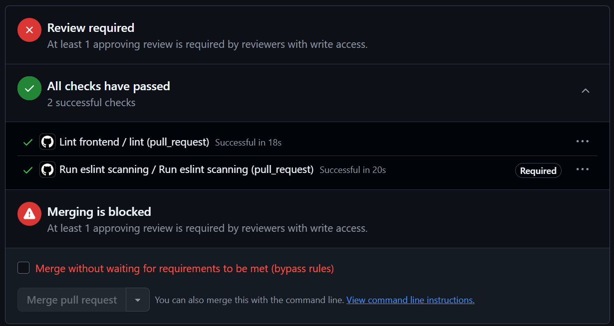

# Final Report: One-Arm Slot Machine II

**Team:** SEVEN ATE NINE

---

## Executive Summary

This report documents the complete development of **One-Arm Slot Machine II**, a fully-fledged pirate-themed slot machine website built using the MERN stack. The project successfully combined rigorous research, strategic AI-driven development, and user-centered design principles to create an engaging, accessible, and maintainable gaming platform.

---

## 1. Research & Planning

Our team conducted comprehensive research across five key domains: frontend development best practices, backend architecture and security, user experience and psychological engagement mechanics, and AI-driven development strategy. Research focused on understanding slot machine design patterns, user retention psychology, sound design science, RTP economics, and security standards. This research informed all architectural and design decisions throughout the project.

**For detailed research findings and team member contributions, see [Research Overview](../plan/research-overview.md)**

---

## 2. User & Stakeholder Personas

We developed two key personas to guide design decisions: **Joy**, a high school student seeking free entertainment and social competition through casual play sessions, and **Joe**, a venture capitalist investor focused on user retention, app store reputation, and engagement metrics. These personas shaped core features including free-to-play mechanics, vibrant UI design, responsive accessibility, and retention systems.

**For detailed persona profiles and user stories, see:**

- [Player Persona: Joy](../plan/persona-documents/player-persona.md)
- [Stakeholder Persona: Joe](../plan/persona-documents/stakeholder-persona.md)

---

## 3. Development Strategy

We employed an AI-driven, parallelized development strategy: equipped Codex with Playwright browser automation, GitHub integration for PR creation, and detailed AGENTS.md specifications. Created well-specified GitHub issues for each feature, assigned multiple tasks simultaneously for parallel execution, and leveraged AI-generated pull requests with comprehensive documentation and testing. Used GPT-5.4 with medium reasoning for optimal balance between speed and accuracy.

**Strategy Evolution:**

- **Initial Phase:** Focused on well-specified GitHub issues with AI-generated PRs for backend setup and core features
- **Log #4 Onward:** Encountered code modularization challenges; had to explicitly emphasize single-responsibility principles and file organization through iterative prompting
- **Log #11 Onward:** Increased bug frequency required pivoting to a bug-focused strategy before resuming feature development
- **Log #15 Onward:** Discovered limitation with asset dependency retrieval; team manually sourced animations and images rather than relying on AI to acquire these resources
- **Key Learning:** Detailed specifications alone were insufficient; iterative refinement and explicit architectural reminders were necessary for optimal code quality

---

## 4. Primary Objectives

**Core Features:**

- Authentication with password encryption + guest login
- Multiple pirate-themed slot machines with consistent mechanics
- Soundtrack and sound effects integrated throughout
- Smooth animations for spins, wins, and celebrations
- Real-time leaderboard system for competition
- Token-based currency with cosmetic shop
- Daily streaks and progressive machine unlocks

**Design Philosophy:** Emphasize wins through sound + animation, minimize loss perception, strategically place near-misses for engagement, provide free daily tokens for non-paying players, and release regular content updates.

---

## 5. Technology Stack

**MERN Stack (MongoDB, Express.js, React, Node.js)**

Selected for cohesion and team familiarity. Unified JavaScript ecosystem reduced context switching, MongoDB's flexible schema accommodated evolving features, Express provided clean API routing, and React's component modularity aligned perfectly with themed machine architecture. Backend implements authentication, game mechanics, and leaderboard services; frontend provides responsive components for gameplay and cosmetic purchases.

---

## 6. Implementation

We employed a parallel AI-driven workflow: created well-specified GitHub issues, assigned multiple tasks to Codex simultaneously, and leveraged AI-generated pull requests with comprehensive documentation. Adhered to clean code principles including meaningful naming, single responsibility functions, DRY approach, comprehensive error handling, and JSDoc documentation.

**Features Delivered:**

- **Game Mechanics:** Multi-reel spinning, symbol matching, configurable bets, win calculations, free spins, progressive jackpots
- **Authentication:** Secure login with encryption, guest mode, persistent accounts, session management
- **Social Features:** Real-time leaderboards, friend system, competition mechanics
- **Economy:** Token-based currency, cosmetic shop, earned rewards
- **User Experience:** Responsive design, smooth animations, sound effects, accessibility compliance, semantic HTML

---

## 7. Testing & Quality Assurance

**Test Coverage**

We implemented comprehensive test suites across backend and frontend:

- **Backend Tests:** Authentication flows, controller logic, data models, game mechanics validation, and input validator rules
- **Frontend Tests:** Animation state management, audio settings, authentication components, celebration effects, leaderboard displays, client services, icon rendering, and theme system

**Continuous Integration & Code Quality**

GitHub Actions workflows enforce code quality on every push and pull request:

- **ESLint Workflow:** Automated linting and typechecking on all code changes (runs on main branch pushes, pull requests, and weekly schedule). Validates code style, best practices, and TypeScript type safety across the entire codebase using Node.js v22
- **Frontend Linting Workflow:** Dedicated frontend linting and typechecking that runs on pull requests and main branch pushes. Ensures React component code quality, consistent formatting, and type correctness. Automatically fails the build if linting or typecheck errors are detected, preventing problematic code from being merged

Both workflows use npm caching for fast feedback loops and standardized Node.js v22 environment. These automated quality gates ensure consistent code standards, prevent regressions, and maintain the long-term maintainability of the codebase.

---

## 8. Key Design Decisions

**Psychological Engagement:** Volatility balance (frequent small wins + rare big payouts), strategically placed near-misses, audio reinforcement, quick loss transitions, delayed reel stopping for tension.

**Retention Mechanics:** Daily streaks with cumulative benefits, progressive unlocks at milestones, cosmetic rewards for achievement, social leaderboards, regular content updates.

**Accessibility & Inclusivity:** Responsive design, semantic HTML, screen reader support, high contrast, keyboard navigation, mobile-first approach.

---

## 9. Results & Achievements

**Project Completion:**

- ✅ Full-featured slot machine website
- ✅ Pirate-themed visual design with custom assets
- ✅ Multi-machine support with distinct themes
- ✅ Secure authentication system
- ✅ Leaderboard & social features
- ✅ Sound and animation systems
- ✅ Cosmetic shop with earned currency
- ✅ Responsive, accessible UI
- ✅ Comprehensive test coverage
- ✅ Clean, maintainable codebase

---

## 10. Technical Learnings

**AI-Driven Development:** Parallel task execution dramatically reduced development time; detailed specifications (AGENTS.md, issue templates) were critical for agent effectiveness; Playwright automation enabled continuous visual verification.

**Technology Stack:** Unified JavaScript eliminated integration friction; MongoDB's flexibility accommodated evolving requirements; React's component modularity aligned perfectly with themed architecture; API-first backend enabled parallel development.

**Game Design:** Psychology-informed mechanics (RTP, near-misses, sound) measurably impact engagement; volatility balance directly affects retention; accessibility opens markets to time-constrained players; social features significantly enhance engagement.

---

## 11. Future Roadmap

**Short-term:** Progressive levels, weekly challenges, advanced cosmetic shop, friend gifting, mobile app

**Medium-term:** Tournament modes, seasonal content, player profiles, guild systems, analytics dashboard

**Long-term:** VIP tiers, dynamic RTP, procedural generation, cross-platform sync, community features

---

## Conclusion

One-Arm Slot Machine II successfully synthesizes rigorous research, user-centered design, and modern development practices into a fully-featured gaming platform. By combining psychological principles with accessible gameplay, we created a product serving entertainment-seeking players while maintaining sustainable engagement metrics for stakeholders.

The project validates the efficacy of evidence-based game design, persona-driven development, parallel AI-driven workflows, clean code practices, and inclusive design principles. This foundation positions the platform for successful scaling and feature expansion as the player base grows.
